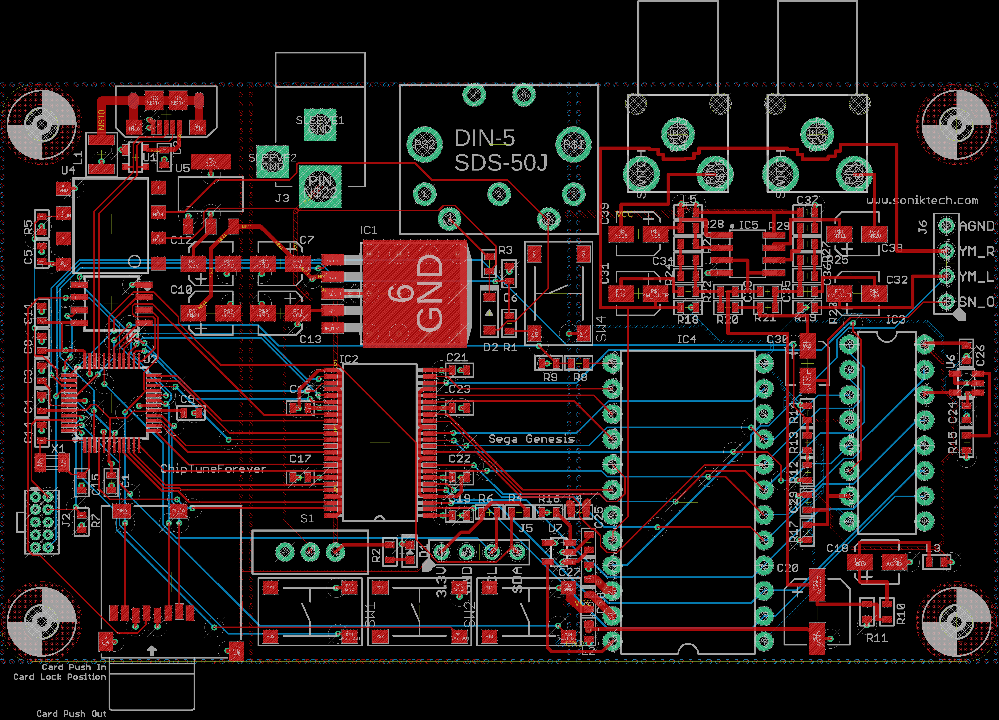

# sega-genesis-forever
A Standalone Sega Genesis music player using native hardware

Using an ATSAMD21 microcontroller, this gadget reads Sega Genesis VGM files from a microSD card and plays them back using the same sound chips that were used in the original Sega Genesis. Even the audio path is cloned from original schematics!

